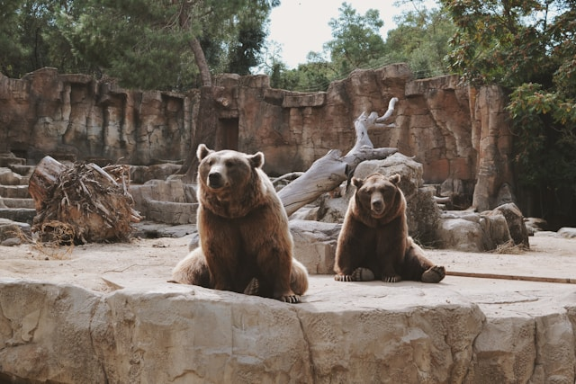
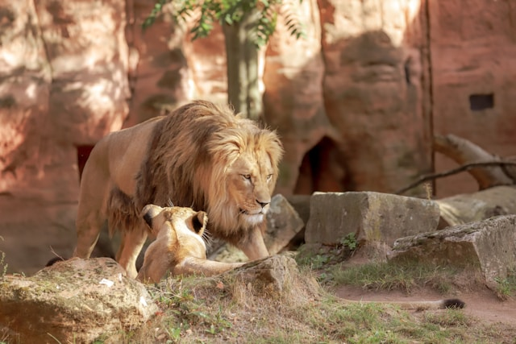
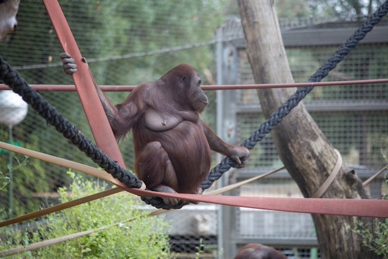
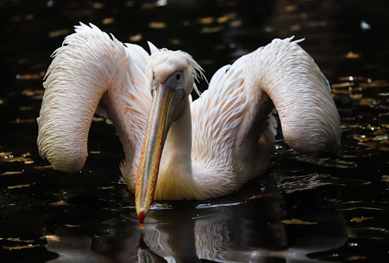
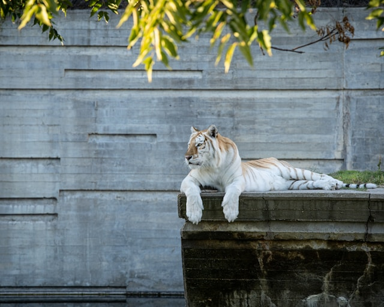

# odin-landing-page

Source for image 1: [Unsplash - Wilkins Morales](https://unsplash.com/photos/brown-bear-and-baby-bear-on-gray-concrete-wall-during-daytime-eLcPJeK_Unk)

--

Source for image 2: [Unsplash - MARIOLA GROBELSKA](https://unsplash.com/photos/a-lion-and-its-cub-in-a-zoo-enclosure-dWV2o6EnK2U)

--

Source for image 3: [Unsplash - JavyGo](https://unsplash.com/photos/brown-monkey-on-brown-rope-during-daytime--_r4Bz-3To4)

--

Source for image 4: [Unsplash - MARIOLA GROBELSKA](https://unsplash.com/photos/a-large-white-bird-with-a-long-beak-floating-in-the-water-5naKKKRsU0k)

--

Source for image 5: [Usnplash - Angel Luciano](https://unsplash.com/photos/a-white-tiger-laying-on-top-of-a-cement-wall-zTGzwYKXC-A)
